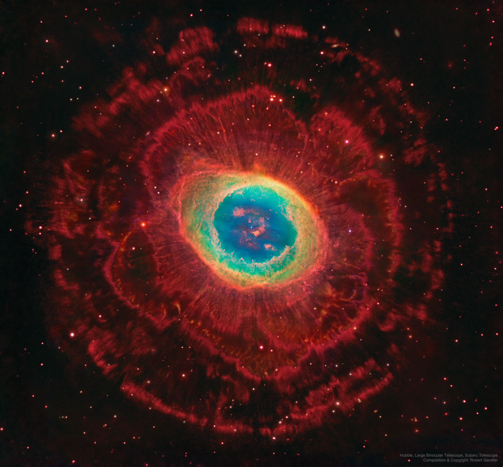
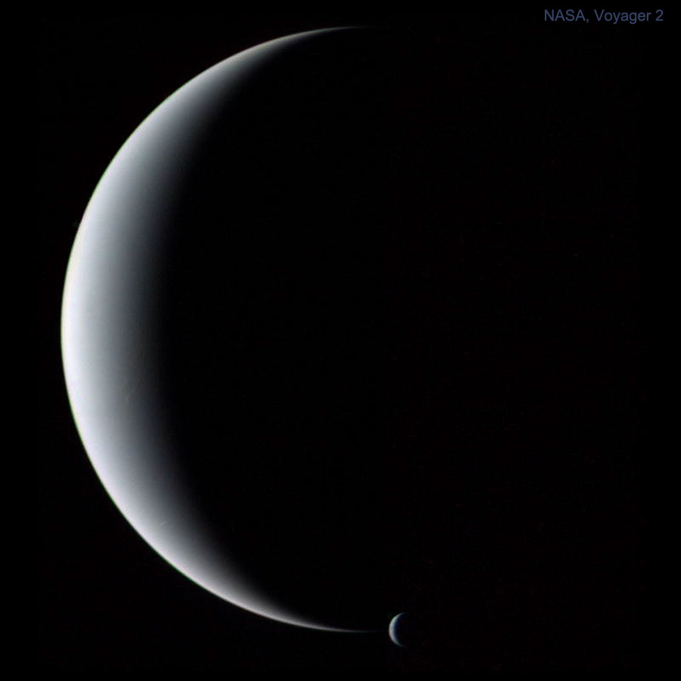

# nasa_background

## Installation

1. get api_key from nasa (https://api.nasa.gov/)
2. create .env file by example
3. ```pip install -r -requirements.txt```
4. ```sudo apt install cron``` (cron needs to run script periodically)

## Usage

1. run ```gsettings set org.gnome.desktop.background picture-uri '$path_to_your_backround_img'``` in terminal (works for gnome)
2. run ```crontab -e```
3. add ```0 0 * * * * /usr/bin/python $path_to_script``` to cron






color: #414A4C
