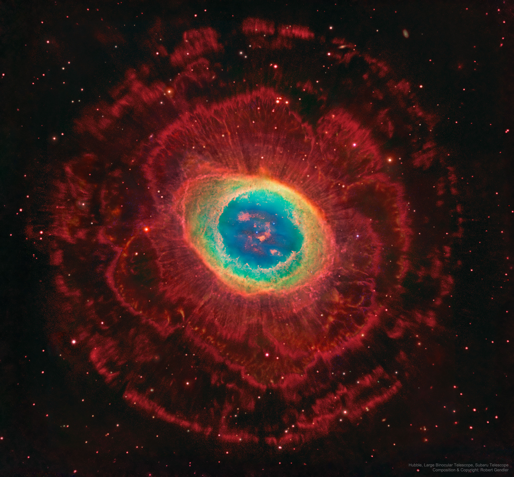

# nasa_background

Daily backgrounds from nasa api. Beautiful and interesting images every day by python script.

## Installation

1. get api_key from nasa (https://api.nasa.gov/)
2. create .env file by example
3. ```pip install -r -requirements.txt```
4. ```sudo apt install cron``` (cron needs to run script periodically)


## Usage

Depending on OS, just replacing the original image could be enough to update the actual background.

#### Gnome: 

run ```gsettings set org.gnome.desktop.background picture-uri '$path_to_your_backround_img'``` in terminal. To make background update when original image is replaced.

### To make it update daily:

#### Anacron

With anacron, you can set cron job to run the script at midnight, and even if your system was off at the time, the script will run at the startup later that day.

- run ```crontab -e```
- add ```0 0 * * * /usr/bin/python {PATH_TO_SCRIPT}``` to cron. (add ```>> /home/{YOUR_USERNAME}/logs/cron_nasa.log 2>&1``` to log output)


#### Using systemd

put updated `nasa_back.service` and `nasa_back.timer` into `/home/{YOUR_USERNAME}/.config/systemd/user/`

- also has retry policy





color: #414A4C
